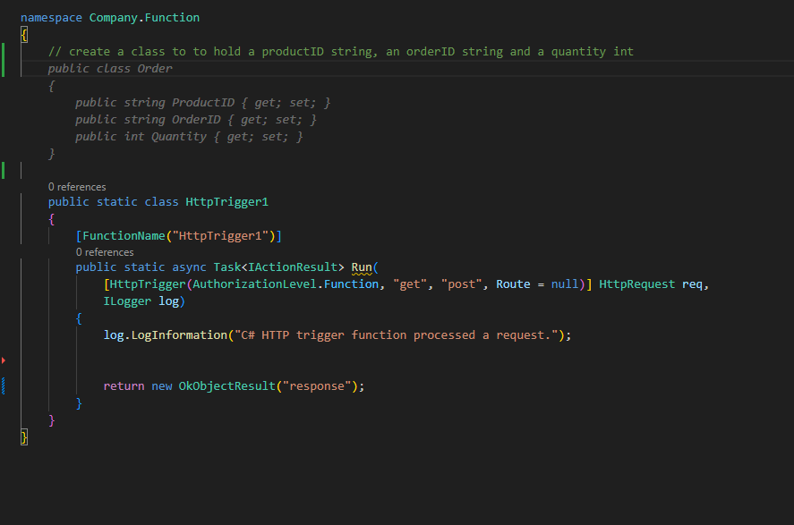
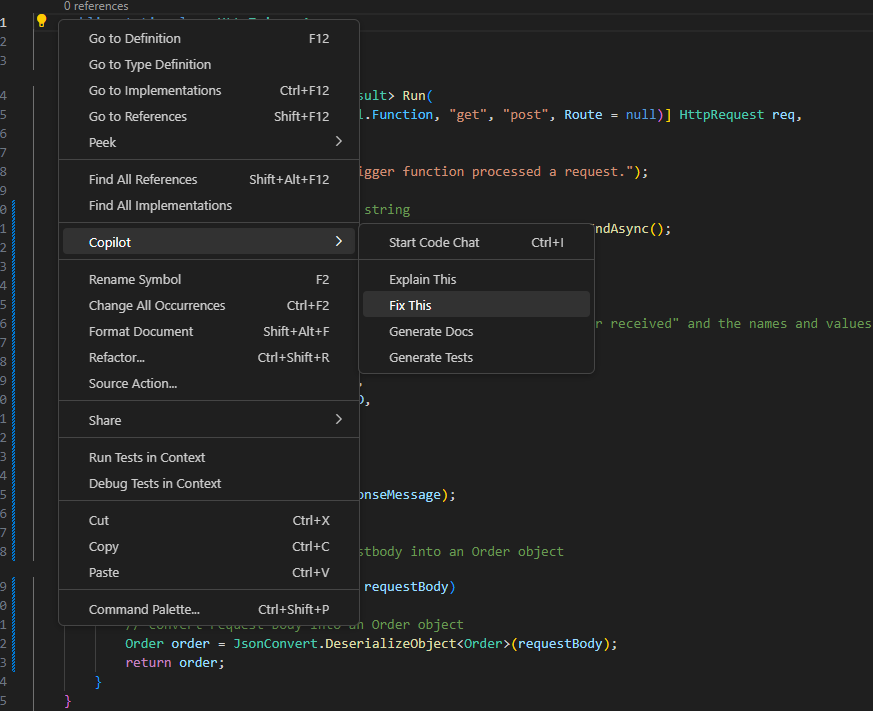
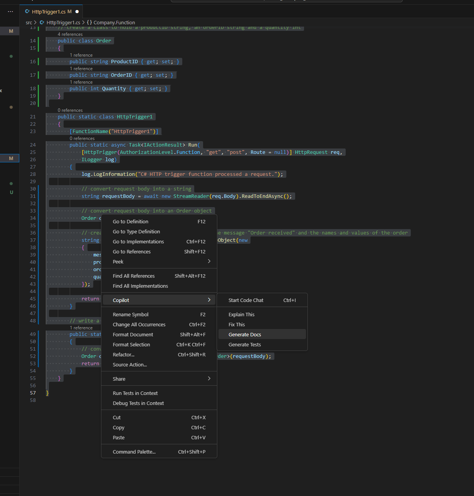
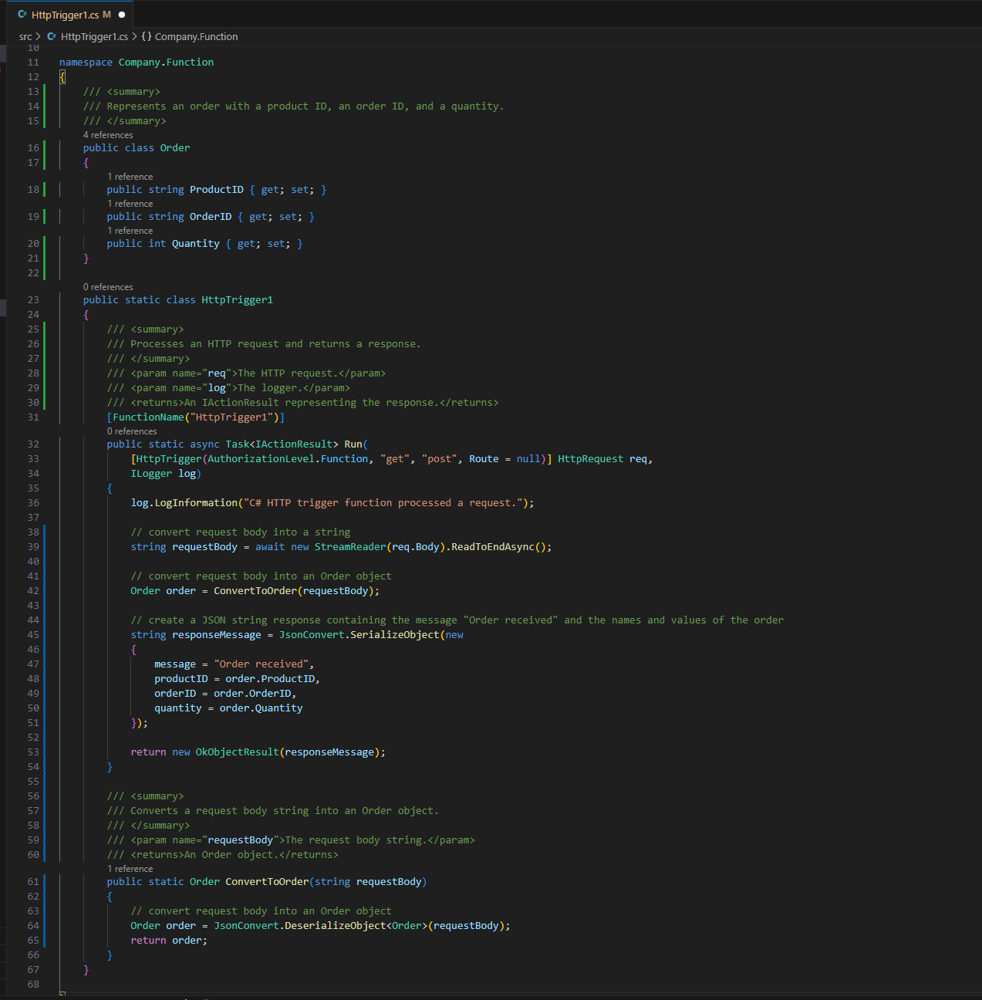
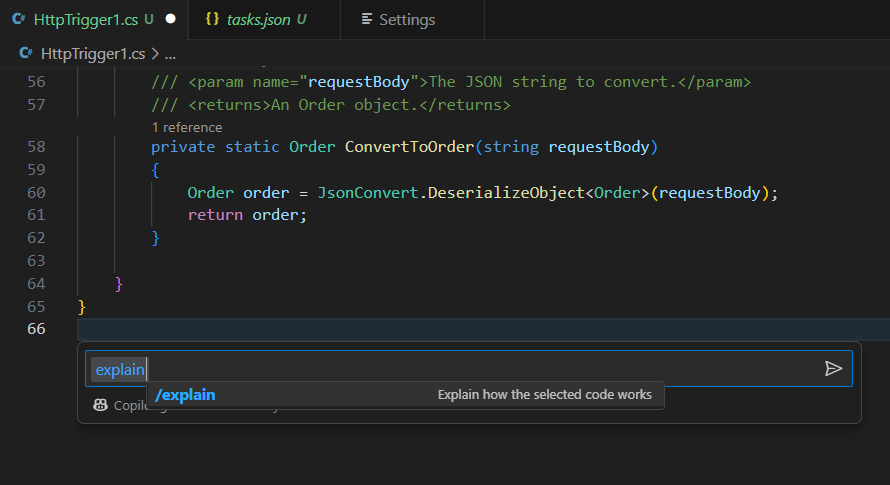
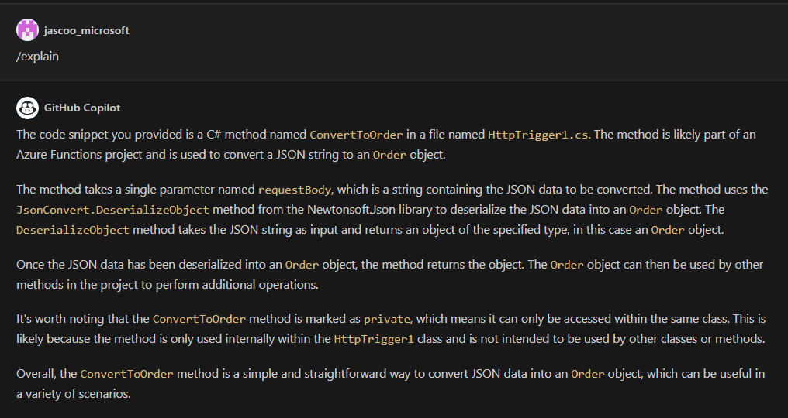

# Basic Copilot demo

Assume we're tasked with creating a REST API that takes in an order for our product, prepares it for additional processing such as db persistence, etc, then responds to the caller with a valid response.  Using Copilot:
* Code completion
* Test case generation
* Code documentation
* Explain code

We'll implement a REST handler, serialize the payload into an object, respond to the caller with valid response, write test cases and document the fuctionality as well as use Copilot to fix any problems along the way.

### 1. Create the required functionality using code completion

Beginning with the stubbed class for an HTTP trigger function.  Using an inline comment, prompt Copilot to generate an Order class containing the relevant fields for our order object:

        // create a class to hold a productID string, an orderID string and a quantity int

Copilot creates an Order class:

Convert the incoming request body to a string:

    // convert request body into a string

Create a method that deserializes the request string into our Order object:

    // write a method to convert the request body into an order object

Use the new method to convert the payload:

    // convert request body into an order object

Return an Order Recieved message to the caller containing the original payload, this time using Copilot Chat companion:

    // return a JSON string response containing the message "Order Received" and names and values of the order

Assume that a change was introduced to the code that boke its functionality.  Fix this by highlighting the code, through the Copilot conext menu, choose Fix:

### 2. Generate test case using test case generation

Again using the Copilot context menu, highlight the target code and choose Generate Tests:

A test class is generated:

### 3. Document the class using documentation generation

Using the Copilot context menu, highlight the target code and choose Generate Docs:

Documentation is created:

### 4. Using the chat window, generarate an explanation for the code

### 5. Optionally test the code to demonstrate end-to-end functionality

### 6. Persisting the Order Object to Cosmos DB

To enhance our REST API, we've now included functionality to persist the order object to Cosmos DB. This involves initializing a Cosmos DB client, parsing the HTTP request into an `Order` object, and then persisting this object to Cosmos DB. Here's a brief overview of the steps involved:

1. **Initialize Cosmos DB Client**: At the start of our function, we initialize a Cosmos DB client using the connection string stored in our local settings.

2. **Parse HTTP Request**: We parse the incoming HTTP request to extract the order details and serialize them into an `Order` object.

3. **Persist to Cosmos DB**: Finally, we use the Cosmos DB client to persist the `Order` object to our database.

This addition ensures that every order processed by our REST API is now stored in Cosmos DB, allowing for further processing and analysis down the line.
